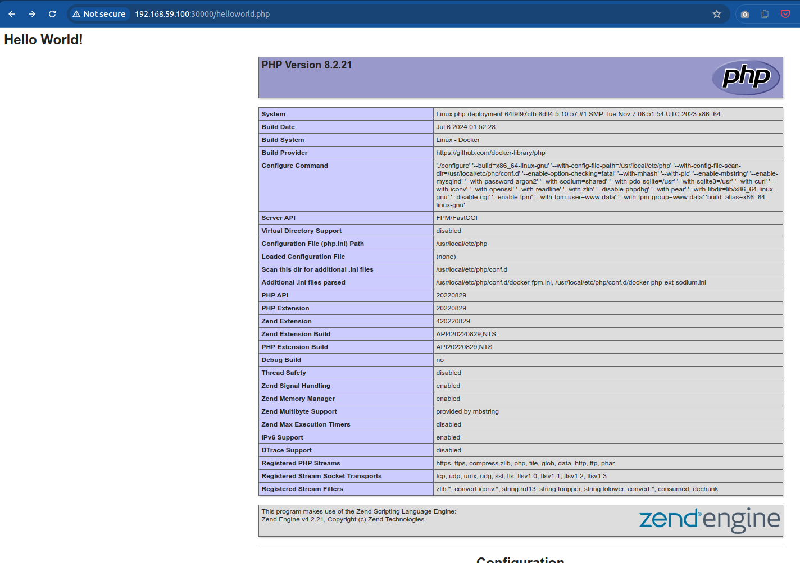

This directory contains Kubernetes manifests for deploying PHP application
https://github.com/BojanKomazec/php-demo to Minikube.

## Checking prerequisites

To verify that kubectl's current context is Minikube:
```
$ kubectl config get-contexts
$ kubectl config view
$ kubectl cluster-info
```

If context is not set to Minikube, set it with this command:
```
$ kubectl config set current-context minikube
```

## Deployment

To create ConfigMap (in cluster's `default` namespace) with Nginx config:
```
$ kubectl create configmap nginx-config --from-file=default.conf
configmap/nginx-config created
```

We can also create a file `nginx-configmap.yaml` with the full content,
respecting the required format of ConfigMap manifest and then deploy it with:
```
$ kubectl apply -f nginx-configmap.yaml
```

To list all ConfigMaps:
```
$ kubectl get configmaps
```

To view ConfigMap:
```
$ kubectl get configmap nginx-config -o yaml
```
or
```
$ kubectl describe configmap nginx-config
```

To delete ConfigMap (if need to re-create it):
```
$ kubectl delete configmap nginx-config
configmap "nginx-config" deleted
```

Apply the Persistent Volume and Persistent Volume Claim:
```
$ kubectl apply -f persistent-volume.yaml
persistentvolume/php-app-pv created
persistentvolumeclaim/php-app-pvc created
```

Before applying deployments which include locally built Docker images we first
need to load them into Minikube Docker environment.

Example:
```
$ minikube image load php-demo-fpm-debian-image:latest
```

After this, we can check that Minikube Docker environment contains that image:
```
$ eval $(minikube docker-env)
$ docker image ls
$ eval $(minikube docker-env -u)
```

Side note: these are the environment variables that get set by
`minikube docker-env`:

```
$ minikube docker-env
export DOCKER_TLS_VERIFY="1"
export DOCKER_HOST="tcp://192.168.59.100:2376"
export DOCKER_CERT_PATH="/home/bojan/.minikube/certs"
export MINIKUBE_ACTIVE_DOCKERD="minikube"

# To point your shell to minikube's docker-daemon, run:
# eval $(minikube -p minikube docker-env)
```

We can now deploy the application:
```
$ kubectl apply -f php-deployment.yaml
deployment.apps/php-deployment created
service/php-fpm created

$ kubectl apply -f nginx-deployment.yaml
deployment.apps/nginx-deployment created
service/nginx-service created
```

## Testing the PHP application

To test PHP, in your browser, go to `http://<minikube_ip>:30000/helloworld.php`:




## Tearing down

To remove all:
```
$ kubectl delete -f nginx-deployment.yaml
deployment.apps "nginx-deployment" deleted
service "nginx-service" deleted

$ kubectl delete -f php-deployment.yaml
deployment.apps "php-deployment" deleted
service "php-fpm" deleted

$ kubectl delete -f persistent-volume.yaml
persistentvolume "php-app-pv" deleted
persistentvolumeclaim "php-app-pvc" deleted

$ kubectl delete configmap nginx-config
configmap "nginx-config" deleted
```


## Troubleshooting

To check the status of pods (`-A` denotes all namespaces):
```
$ kubectl get pod -A
```

To get details of the pod:
```
$ kubectl describe pod <pod_name>
```

To get logs of some container:
```
$ kubectl logs <deployment_name> -c <container_name>
```

To get logs of the initContainer:
```
$ kubectl logs <pod_name> -c <init_container_name>
```
`init_container_name` is in our case `init-copy-php-app`.

To get the shell of the container running in a pod:
```
$ kubectl exec --stdin --tty <pod_name> -- bash
```

