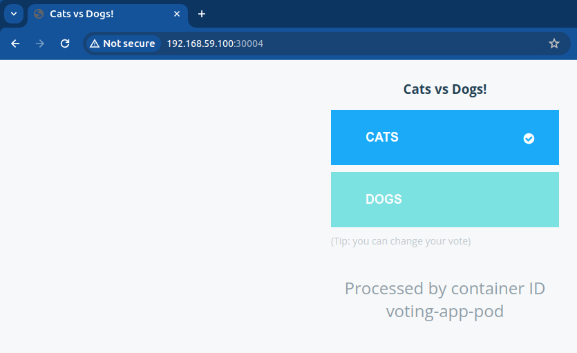
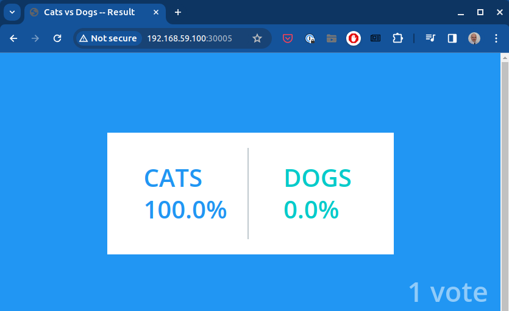

Components (all are Dockerized applications):
- Voting app (https://hub.docker.com/r/kodekloud/examplevotingapp_vote)
- Redis (https://hub.docker.com/_/redis)
- Worker app (https://hub.docker.com/r/kodekloud/examplevotingapp_worker)
- Postgres (https://hub.docker.com/_/postgres)
- Result app (https://hub.docker.com/r/kodekloud/examplevotingapp_result)

Plan of actions:
* write definition files for pods for each component
* write definition files for services for each component apart from the Worker app (in order to expose them internally/externally)
* create Kubernetes objects defined in definition files
  * Verify that the default namespace is empty:
    ```
    $ kubectl get all
    No resources found in default namespace.
    ```
  * If it's not empty, list all objects in there and delete all objects for each object category:
    ```
    $ kubectl delete service --all
    $ kubectl delete deployment --all
    $ kubectl delete replicaset --all
    $ kubectl delete pod --all
    ```
  * create pods and services:
    ```
    $ kubectl create -f ./minikube/voting-app/pods/voting-app-pod.yaml
    $ kubectl create -f ./minikube/voting-app/services/voting-app-service.yaml
    $ kubectl create -f ./minikube/voting-app/pods/redis-pod.yaml
    $ kubectl create -f ./minikube/voting-app/services/redis-service.yaml
    $ kubectl create -f ./minikube/voting-app/pods/postgres-pod.yaml
    $ kubectl create -f ./minikube/voting-app/services/postgres-service.yaml
    $ kubectl create -f ./minikube/voting-app/pods/worker-app-pod.yaml
    $ kubectl create -f ./minikube/voting-app/pods/result-app-pod.yaml
    $ kubectl create -f ./minikube/voting-app/services/result-app-service.yaml
    ```
  * check if pod and service are created; check if service is forwarding request to the pod (use curl or browser)
    ```
    $ kubectl get pod,svc
    $ minikube service voting-service --url
    http://192.168.59.100:30004
    $ curl http://192.168.59.100:30004
    $ minikube service result-service --url
    http://192.168.59.100:30005
    $ curl http://192.168.59.100:30005
    ```
  * To apply change in pod's configuration file, simply delete affected pod and re-create it. It is not necessary to re-create service which targets that pod.
* Final results:
  * voting app in the browser:

    
  * Results app in the browser:

    
